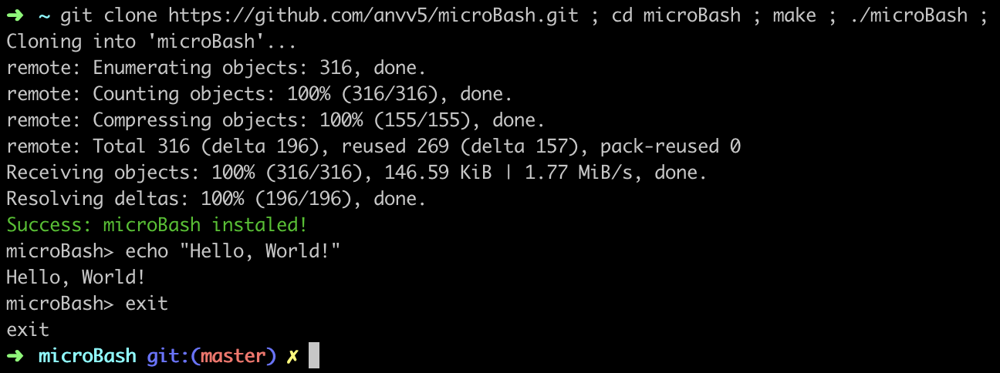

# microBash



Simple shell implementation, that supports:
- search and launch the right executable
- **echo** with option ’-n’
- **cd** with only a relative or absolute path
- **pwd** without any options
- **export** without any options
- **unset** without any options
- **env** without any options and any arguments
- **exit** without any options
- Command separates with: **;**
- **'** and **"** (except for multiline commands)
- Redirections: **<**, **>**, **>>**
- Pipes: **|**
- Environmental variables: **$**
- **$?**
- Signals: **ctrl-C, ctrl-D, ctrl-\\**


## Installation

```bash
git clone https://github.com/anvv5/microBash.git ; cd microBash ; make ; ./microBash ;

```

